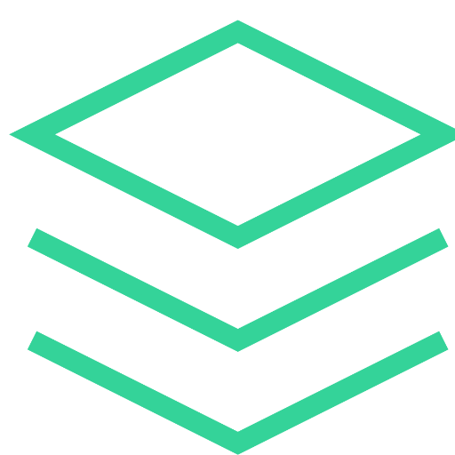

# Kinnema 🎬

> A modern, **decentralized** cross-platform streaming application built with React, TypeScript, and Electron
> [https://kinnema.app](https://kinnema.app) > 

## 🌟 Features

- **🌐 Decentralized Sync** (experimental): No central server required - sync your data across devices using the Nostr protocol
- **🔒 Data Sovereignty**: Your watch history and preferences stay under your control
- **📡 Peer-to-Peer** (soon): Direct device-to-device synchronization without intermediaries
- **🎬 Comprehensive Media Library**: Browse movies and TV series from popular networks like Netflix, HBO, and more
- **📱 Cross-Device Sync** (Experimental): Synchronize your watch history and favorites across devices using Nostr protocol
- **🎵 Subtitle Support** (Experimental, Native Only): Built-in subtitle functionality with customizable settings
- **👥 Watch Together** (Experimental): Share watching sessions with friends in real-time rooms
- **⭐ Favorites Management**: Save and organize your favorite shows and movies
- **🎨 Modern UI**: Beautiful, responsive interface built with Tailwind CSS/Shadcn
- **🌙 Theme Support**: Dark/light theme switching
- **🔌 Plugin System**: Support for streaming plugins
- **📺 HLS Streaming**: Support for adaptive streaming with HLS.js
- **🔄 Auto-Updates**: Seamless app updates via Capacitor Updater
- **💾 Offline Storage**: Local database with RxDB for offline functionality
- **🌐 Internationalization**: Multi-language support with i18next

## 🚀 Quick Start

### Prerequisites

- Node.js 18+
- pnpm (recommended package manager)
- Git

### Installation

1. **Clone the repository**

   ```bash
   git clone https://github.com/kinnema/frontend.git
   cd kinnema
   ```

2. **Install dependencies**

   ```bash
   pnpm install
   ```

3. **Start development server**

   ```bash
   pnpm dev
   ```

4. **Open your browser**
   Navigate to `http://localhost:3000`

## 🏗️ Build & Deploy

### Web Build

```bash
pnpm build
```

### Desktop (Electron)

```bash
# Development
pnpm electron:dev

# Build for current platform
pnpm electron:build

# Build for specific platforms
pnpm electron:build:win    # Windows
pnpm electron:build:mac    # macOS
pnpm electron:build:linux  # Linux
```

### Mobile (Capacitor)

#### Android

```bash
npx cap add android
npx cap sync android
npx cap open android
```

#### iOS

```bash
npx cap add ios
npx cap sync ios
npx cap open ios
```

## 🛠️ Tech Stack

### Frontend

- **React 19** - Modern React with latest features
- **TypeScript** - Type-safe JavaScript
- **Vite** - Fast build tool and dev server
- **TanStack Router** - Type-safe routing
- **TanStack Query** - Server state management
- **Zustand** - Client state management

### UI Framework

- **Tailwind CSS** - Utility-first CSS framework
- **Lucide React** - Beautiful icon library
- **Motion** - Smooth animations
- **Embla Carousel** - Touch-friendly carousels

### Cross-Platform

- **Electron** - Desktop applications
- **Capacitor** - Native mobile apps
- **Web** - Web support

### Data & Networking

- **RxDB** - Reactive database
- **Dexie** - IndexedDB wrapper
- **HLS.js** - HTTP Live Streaming
- **Nostr Tools** - Decentralized sync protocol

### Development Tools

- **ESLint** - Code linting
- **TypeScript** - Static type checking
- **Concurrently** - Run multiple commands
- **Wait-on** - Wait for resources

## 📱 Platform Support

| Platform    | Status          | Features                         |
| ----------- | --------------- | -------------------------------- |
| **Web**     | ✅ Partial Support | Most features are available   |
| **Desktop** | ✅ Full Support | Native desktop app with Electron |
| **Android** | ✅ Full Support | Native Android app               |
| **iOS**     | ✅ Full Support | Native iOS app                   |

## 🎬 Core Features

### Content Discovery

- Browse trending movies and TV shows
- Network-specific collections (Netflix, HBO, etc.)
- Advanced search with filters (soon)
- Personalized recommendations (soon)

### Streaming Experience

- High-quality video playback
- Adaptive streaming with HLS
- Multiple subtitle options
- Picture-in-picture support
- Full-screen mode

### Customization

- Dark/light themes
- Experimental features
- Language selection

## 🔧 Configuration

### Environment Variables

Copy `.env.example` as `.env` file in the root directory:

### Capacitor Configuration

The app is configured for native deployment with Capacitor. See `capacitor.config.ts` for platform-specific settings.

## 📚 Scripts

| Script                | Description                   |
| --------------------- | ----------------------------- |
| `pnpm dev`            | Start development server      |
| `pnpm build`          | Build for production          |
| `pnpm lint`           | Run ESLint                    |
| `pnpm electron:dev`   | Start Electron in development |
| `pnpm electron:build` | Build Electron app            |

## 🤝 Contributing

We welcome contributions! Please see our [Contributing Guidelines](CONTRIBUTING.md) for details.

1. Fork the repository
2. Create your feature branch (`git checkout -b feature/amazing-feature`)
3. Commit your changes (`git commit -m 'Add some amazing feature'`)
4. Push to the branch (`git push origin feature/amazing-feature`)
5. Open a Pull Request

## 📄 License

This project is licensed under the MIT License - see the [LICENSE](LICENSE) file for details.

## 🙏 Acknowledgments

- [The Movie Database (TMDB)](https://www.themoviedb.org/) for movie and TV data
- [Radix UI](https://www.radix-ui.com/) for accessible UI components
- [TanStack](https://tanstack.com/) for excellent React libraries
- [Capacitor](https://capacitorjs.com/) for cross-platform capabilities

## 📞 Support

- 🐛 [Report Bugs](https://github.com/kinnema/frontend/issues)
- 💡 [Feature Requests](https://github.com/kinnema/frontend/discussions)
---

<div align="center">
  <strong>Built with ❤️ by the Kinnema Team</strong>
</div>

## 🌐 Decentralized Architecture

Kinnema embraces decentralization through:

- **Nostr Protocol Integration**: Synchronize your watch history, favorites, and settings across devices without relying on centralized servers
- **Local-First Data Storage**: All your data is stored locally using RxDB, with optional decentralized sync
- **Plugin Ecosystem**: Extensible architecture supporting both centralized and decentralized content sources
- **No Vendor Lock-in**: Your data remains portable and under your control

### Why Decentralized?

- **Privacy**: Your viewing habits aren't tracked by central authorities
- **Resilience**: No single point of failure
- **Censorship Resistance**: Content discovery through multiple sources
- **Data Ownership**: You control your own data and preferences
