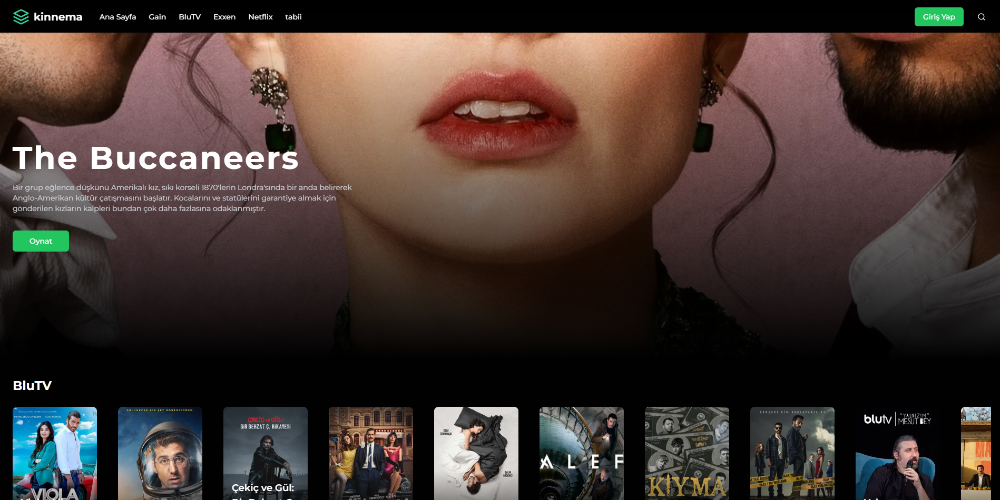

# Kinnema

Kinnema is a modern movie application that leverages the VidSrc API to provide users with a seamless experience for discovering, searching, and watching movies and TV series. Built with Next.js, TypeScript, and Tailwind CSS, Kinnema offers a fast, responsive, and user-friendly interface.

[Live Demo](https://kinnema.vercel.app)



## Features

- **Browse & Search:** Discover trending movies and series, or search for specific titles.
- **Authentication:** Secure login and user management.
- **Favorites:** Add movies and series to your favorites list.
- **Continue Watching:** Resume watching from where you left off.
- **Responsive UI:** Optimized for all devices with a clean, modern design.
- **PWA Support:** Installable as a Progressive Web App for offline access.
- **API Integration:** Powered by VidSrc and TMDB for rich metadata and streaming links.

## Tech Stack

- **Framework:** [Next.js](https://nextjs.org/)
- **Language:** TypeScript
- **Styling:** Tailwind CSS
- **API:** TMDB
- **State Management:** Custom hooks and stores
- **Icons:** Lucide-react
- **PWA:** Manifest and service worker support

## Project Structure

```
.
├── app/                # Next.js app directory (pages, layouts, providers)
├── components/         # Shared React components
├── hooks/              # Custom React hooks
├── lib/                # API clients, models, constants, stores
├── public/             # Static assets (icons, images)
├── styles/             # Global styles (Tailwind, PostCSS)
├── .env.example        # Example environment variables
├── openapi.yaml        # OpenAPI spec for backend API
├── package.json        # Project dependencies and scripts
└── README.md           # Project documentation
```

## Getting Started

1. **Clone the repository:**
   ```sh
   git clone https://github.com/kinnema/frontend.git
   cd frontend
   ```

2. **Install dependencies:**
   ```sh
   npm install
   ```

3. **Configure environment variables:**
   - Copy `.env.example` to `.env` and fill in the required values.

4. **Run the development server:**
   ```sh
   npm run dev
   ```

5. **Build for production:**
   ```sh
   npm run build
   npm start
   ```

## Configuration

- **API Endpoints:** Configure API URLs and keys in the `.env` file.
- **PWA:** Manifest is defined in `app/manifest.ts`.

## Contributing

Contributions are welcome! Please open issues or submit pull requests for improvements and bug fixes.

## License

This project is licensed under the MIT License.

---

Enjoy
